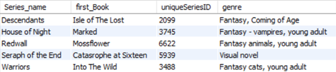
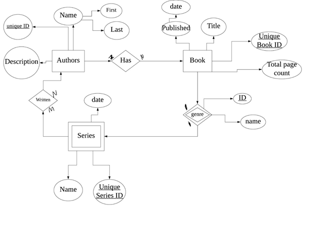

# Author SQL Database

 The purpose of this database that is a one to be used to track authors and the projects they have finished, along with their publisher and publication date. All authors have a name, and a small description of any works they may have been credited to. The books table adds the title of the first book of said author, along with a complete page count and the publisher associated with this author and work. Each book is a part of a series, and in the series table, there is the series name in which the book is a part of, along with the genre that belongs to each series and in turn book. Each genre is a short description of what the book and series have to offer for every kind of reader. The publisher table just gives a slight more insight on what publication company goes with which series and book.

 

 